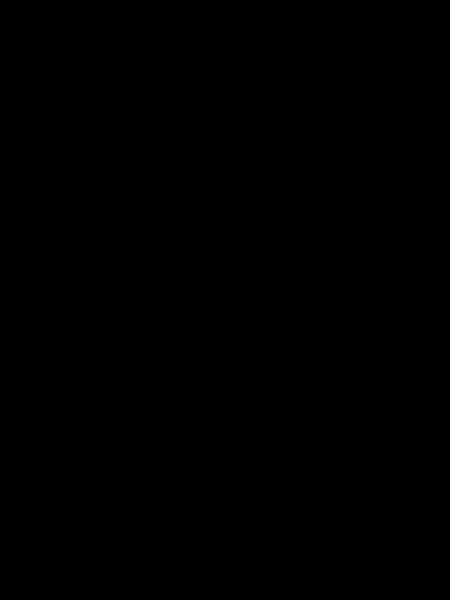

# GTAV Autonomy 

This is a self driving program based on the game GTAV and the work DeepGTAV and it's variant DeeperGTAV. GTAV is a not opensouce, but still a moddable game. Thus it can be turned into a simulation environment for research. In compare to other opensouce simulaters, GTAV has more realistic grafics and variable environments, which is ideal to develop a personal self driving algorithm for research.

The program is unfinished. More algorithms will be added, current algorithms will be changed in the future.

## Dependencies & environment

* GTAV
* Script Hook V
* DeeperGTAV Build (modified! see below)
* Vpilot
* Python 3.6 with: Numpy, Scipy, Opencv, Autograd, Pyflow, and Vpilot
* Visual Studio (optional, to modify DeeperGTAV)

Modification to DeeperGTAV:

* Lidar setup code is changed to: Lidar sample starts exactly from upper limit to lower limit, from right limit to left limit. Angle bewteen each pair of sample is FOV/(resolution - 1). Only even horizontal resolution supported currently. 
* Native API used for speed signal is changed, so the speed while driving backwards is negative.
* Add changable time scale.

## Installation 

Download Script Hook V, put it and all files in folder "DeeperGTAV modified build" into GTAV's main folder.
Put all Python files in Vpilot's folder. (not in that'/deepgtav')

## Brief explanation: How it works

(Detailed explanation see Technical detail.md)

* dirve.py: setup the simulation environment in GTAV and run the pipeline.

* Class Ground_esti: estimate the driveable area only based on geometry by using Lidar samples, calculate the pitch and roll of the vehicle relate to the road.

* Class Opt_flow: estimate the optical flow between image t and t+1. Magnitude and direction asigned to t+1.

* Class Movement_checker: use optical flow, lidar samples and self movement of the vehicle to distinguish satationary objects and moving objects. Also calculate the speed of moving objects

* Class Lane_finder: detect lane lines and estimate lanes

* Class Lane_controler: a finite state machine to select a lane to drive

* Class Vehicle_controler: a model predictive control to keep the vehicle in lane and avoid collision to other objects.

## To do 

Finish classes Lane_controler and Vehicle_controler.
Deep lerning based scene understanding for drivable area, traffic signs, road markers etc.
Lidar sample classification.
Build a more general finite state machine to overall control the vehicle and give it more functionality.
Refine the current algorithm in classes Movement_checker and Lane_finder.
Imporve code style and performence, may switch to c++ in the future.
